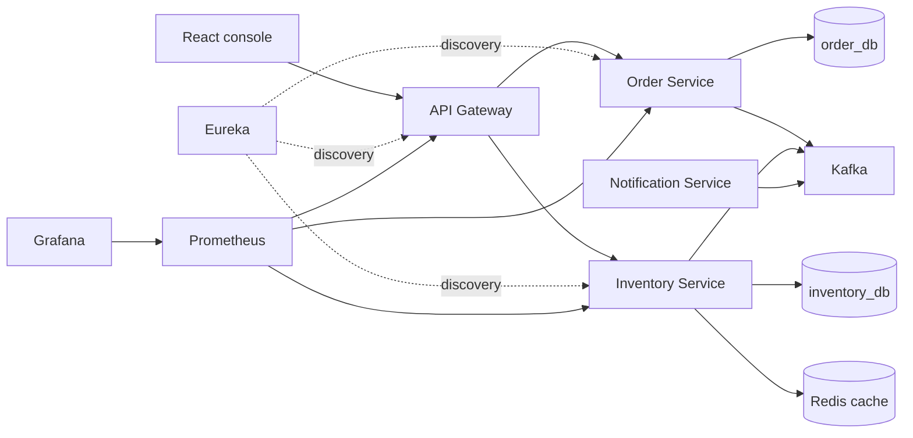

# OrderFlow

A local-first event-driven order workflow built with Spring Boot services, Kafka, Redis, MySQL, and a React console. It demonstrates how an order moves through asynchronous inventory validation and status updates.

**Console preview:** [orderflow-console-surya.vercel.app](https://orderflow-console-surya.vercel.app/)

> The Vercel console uses demo mode. The backend is intended to run locally with Docker Compose; no public production backend is claimed. The demo token endpoint accepts caller-supplied identity and role, so this sample backend must not be exposed to untrusted networks.

## Workflow

1. The client submits an order through the API Gateway.
2. Order Service stores the order as `PENDING` and publishes `orders.placed`.
3. Inventory Service consumes the event, checks stock, updates inventory, and publishes `inventory.updated`.
4. Order Service consumes the result and sets the order to `CONFIRMED` or `FAILED`.
5. Notification Service consumes order and low-stock events and logs notification activity.

## Architecture



## Components

| Component | Port | Responsibility |
|---|---:|---|
| API Gateway | 8080 | Routes order/inventory requests; demo JWT validation, rate limiting, and fallback responses |
| Eureka | 8761 | Service discovery |
| Order Service | 8081 | Creates orders and applies inventory results |
| Inventory Service | 8082 | Validates and updates stock; uses Redis cache-aside reads |
| Notification Service | 8083 | Consumes events and logs demo notifications |
| Kafka | 9092 | Carries order and inventory events |
| Prometheus / Grafana | 9090 / 3000 | Local metrics collection and dashboards |
| React console | 5173 | Local workflow UI |

## Technology

Java 17, Spring Boot 3.3, Spring Cloud Gateway, Eureka, Kafka, Redis, MySQL, Spring Data JPA, Actuator, Micrometer, Prometheus, Grafana, React, Vite, Docker Compose, JUnit 5, and Mockito.

## Run locally

Copy the local example file, change the sample values, then start the stack:

```powershell
Copy-Item .env.example .env
docker compose up --build
```

Open the console at `http://localhost:5173`. Prometheus is at `http://localhost:9090`; Grafana is at `http://localhost:3000`. The local Grafana password comes from `.env`.

To stop the services:

```powershell
docker compose down
```

The Compose values are local development settings only. Never reuse them for a public service. The `/api/auth/token` endpoint issues demo JWTs from caller-provided fields and is not a production authentication design.

## Try the API locally

The console uses `POST /api/auth/token` to request a demo token, then calls `GET /api/inventory/{id}` and `POST /api/orders`. An order normally remains `PENDING` briefly before Kafka processing changes it to `CONFIRMED` or `FAILED`. If it stays pending, inspect the order-service and inventory-service logs and check that Kafka is healthy.

## Observability and failure handling

- Services expose `/actuator/health` and `/actuator/prometheus` for local monitoring.
- Gateway circuit breakers return fallback responses when downstream services are unavailable.
- Kafka consumers use retry handling and a dead-letter topic for failed order events.
- Inventory cache entries are evicted after stock updates.

## Verification

```powershell
.\mvnw.cmd test
cd frontend
npm ci
npm run build
```

GitHub Actions runs the Maven test suite. The current automated tests are focused service-level tests; the repository does not claim end-to-end coverage for every infrastructure component.

## Troubleshooting

- **Order stays `PENDING`:** check Kafka broker health, topic/consumer startup, and service logs.
- **Gateway returns fallback JSON:** check Eureka registration and the target service health endpoint.
- **Rate limiting or cache behavior fails:** confirm Redis is reachable and the gateway/inventory services have the expected Redis host.
- **Port conflict:** adjust the corresponding Compose host port before starting the stack.
- **Grafana sign-in fails:** use the local credentials you set in `.env`; do not rely on public default credentials.

## Project structure

```text
api-gateway/ inventory-service/ order-service/ notification-service/ eureka-server/
common-events/ frontend/ observability/prometheus/ docker-compose.yml
```

## Next engineering steps

- Restrict or replace the demo token endpoint before any public backend deployment.
- Add integration tests covering Kafka delivery, retries, and dead-letter handling.
- Evaluate an outbox pattern for reliable event publication.
